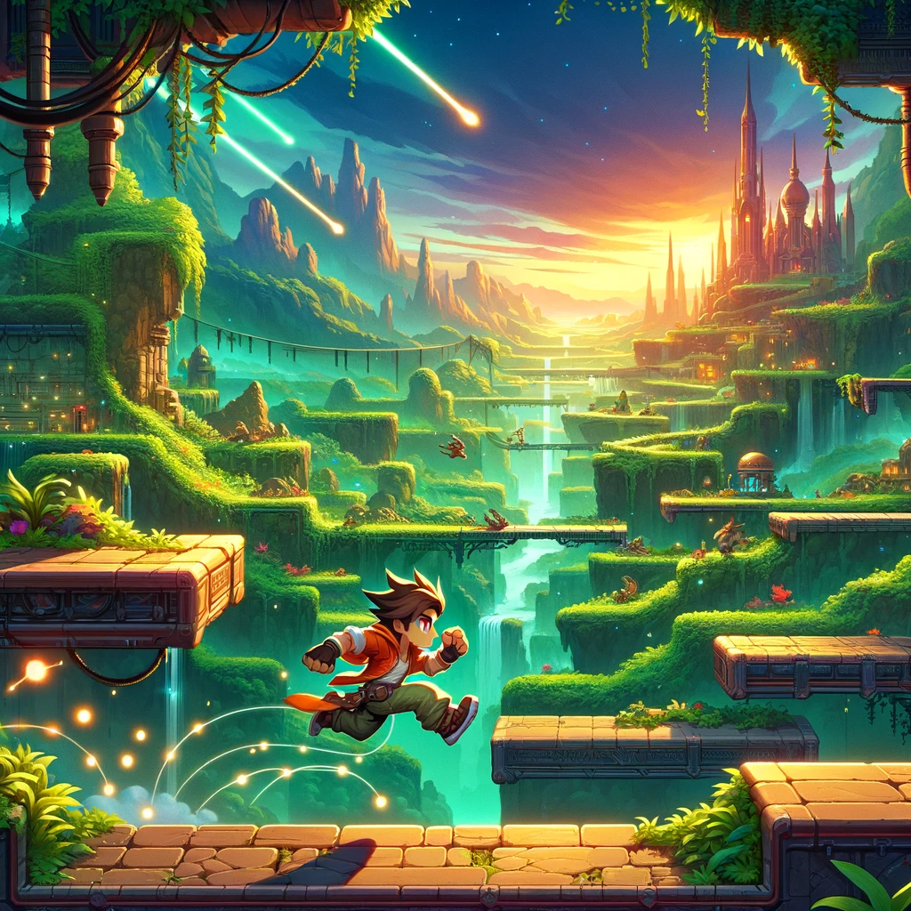

# Project Name
> Outline a brief description of your project.
> Live demo [_here_](https://www.example.com). <!-- If you have the project hosted somewhere, include the link here. -->

## Table of Contents
* [General Info](#general-information)
* [Technologies Used](#technologies-used)
* [Features](#features)
* [Screenshots](#screenshots)
* [Setup](#setup)
* [Usage](#usage)
* [Project Status](#project-status)
* [Room for Improvement](#room-for-improvement)
* [Acknowledgements](#acknowledgements)
* [Contact](#contact)
<!-- * [License](#license) -->

## General Information
- Who you’re working with (you and your team members)?
- Blake Woods
- Mustafa Chambers
- Seth Leifheit
- Fernando Martinez
- Abel Guzman
- What you’re creating? - We are creating a 2d side scroller.
- Who you’re doing it for - We are doing this for people who enjoy old style video games like 2d side scroller.
- Why you’re doing this, the impact or change you hope to make? - Our team chose a side-scroller for its classic appeal, embracing the challenge of innovating within a beloved genre, fueled by our passion for gaming.

## Technologies Used
- Tech 1 - Godot
- Tech 2 - ChatGpt
- Tech 3 - Github

## Features
List the ready features here:
- Awesome feature 1
- Awesome feature 2
- Awesome feature 3

## Screenshots

<!-- If you have screenshots you'd like to share, include them here. -->

## Setup
What are the project requirements/dependencies? Where are they listed? A requirements.txt or a Pipfile.lock file perhaps? Where is it located?

Proceed to describe how to install / setup one's local environment / get started with the project.

## Usage
How does one go about using it?
Provide various use cases and code examples here.

`write-your-code-here`

## Project Status
Project is: _in progress_ / _complete_ / _no longer being worked on_. If you are no longer working on it, provide reasons why.

## Room for Improvement
Include areas you believe need improvement / could be improved. Also add TODOs for future development.

Room for improvement:

To do:
- Title Screen - The initial interface offering options to start a new game or load a saved one, catering to all player types. Aj User Story 1
- Choice a Player - This is where the user will choice a player that is male or female. Blake User Story 4
- Platform - Create a platform for the character sprite to stand on. Seth User Story 3
- Movement - Create a simple movement in the character (left and right). Freddy User Story 1
- Background - Create a background in Godot that moves relative to player movement. Seth User Story 3

## Acknowledgements
Give credit here.
- This project was inspired by...
- This project was based on [this tutorial](https://www.example.com).
- Many thanks to...

## Contact
Created by [@flynerdpl](https://www.flynerd.pl/) - feel free to contact me!

<!-- Optional -->
<!-- ## License -->
<!-- This project is open source and available under the [... License](). -->

<!-- You don't have to include all sections - just the one's relevant to your project -->
