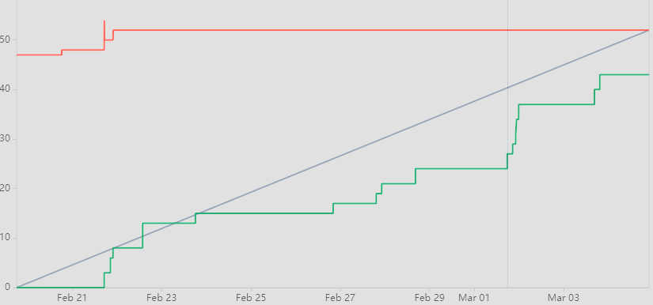

# Project Mayhem
> Outline a brief description of your project.
> Live demo [_here_](https://www.example.com). <!-- If you have the project hosted somewhere, include the link here. -->

## Table of Contents
* [General Info](#general-information)
* [Technologies Used](#technologies-used)
* [Features](#features)
* [Screenshots](#screenshots)
* [Setup](#setup)
* [Usage](#usage)
* [Project Status](#project-status)
* [Room for Improvement](#room-for-improvement)
* [Acknowledgements](#acknowledgements)
* [Contact](#contact)
<!-- * [License](#license) -->

## General Information
- Who you’re working with (you and your team members)?
- Blake Woods
- Mustafa Chambers
- Seth Leifheit
- Fernando Martinez
- Abel Guzman
- What you’re creating? - We are creating a 2d side scroller.
- Who you’re doing it for - We are doing this for people who enjoy old style video games like 2d side scroller.
- Why you’re doing this, the impact or change you hope to make? - Our team chose a side-scroller for its classic appeal, embracing the challenge of innovating within a beloved genre, fueled by our passion for gaming.

## Technologies Used
- Tech 1 - Godot
- Tech 2 - ChatGpt
- Tech 3 - Github

## Features

## Sprint 1

Blake: " Provided users with mob movement, game window, background , and health bar on mobs".

- Task 1: Create simple movement for level one mobs.

[SCRUM45](https://cs3398s24mimas.atlassian.net/jira/software/projects/SCRUM/boards/1?isInsightsOpen=true&selectedIssue=SCRUM-45) 

[bitbucket](https://bitbucket.org/cs3398s24mimas/2d-side-scroller/commits/067dac8d694ce3e5de855b6dc0da55a23b8362ed)

- Task 2: Set up window for the game and set up a window for level 1

[SCRUM60](https://cs3398s24mimas.atlassian.net/jira/software/projects/SCRUM/boards/1?isInsightsOpen=true&selectedIssue=SCRUM-60) 

[bitbucket](https://bitbucket.org/cs3398s24mimas/2d-side-scroller/commits/e53617b7c99be1afafaa92c0090298d9e942298d)

- Task 3: Create the background for level one in pygame

[SRUM30](https://cs3398s24mimas.atlassian.net/jira/software/projects/SCRUM/boards/1?isInsightsOpen=true&selectedIssue=SCRUM-30)

[bitbucket](https://bitbucket.org/cs3398s24mimas/2d-side-scroller/commits/283bcbdf764ff7b83ac1cddfba113f5271daccba)

- Task 4: Create a boundary at the end of the level

[SCRUM61](https://cs3398s24mimas.atlassian.net/jira/software/projects/SCRUM/boards/1?isInsightsOpen=true&selectedIssue=SCRUM-61)

[bitbucket](https://bitbucket.org/cs3398s24mimas/2d-side-scroller/commits/6d895960d2cf53620d8a114625b703ee72da4e5a)

- Task 5: Add a health bar to mobs

[SCRUM46](https://cs3398s24mimas.atlassian.net/jira/software/projects/SCRUM/boards/1?isInsightsOpen=true&selectedIssue=SCRUM-46)

[bitbucket](https://bitbucket.org/cs3398s24mimas/2d-side-scroller/commits/579e940e544bf6cc9b7843de4adfad1f62281a0b)

Freddy: " Provided users with title screen and loading screen ".

- Task 1: Implement title screen interface

[SCRUM25](https://cs3398s24mimas.atlassian.net/jira/software/projects/SCRUM/boards/1?selectedIssue=SCRUM-25)

[bitbucket](https://bitbucket.org/cs3398s24mimas/2d-side-scroller/commits/74e3e9ca6a30056b47cb8336ddd7850c54986462)

- Task 2: Create a loading Screen

[SCRUM35](https://cs3398s24mimas.atlassian.net/jira/software/projects/SCRUM/boards/1?selectedIssue=SCRUM-35)

[bitbucket](https://bitbucket.org/cs3398s24mimas/2d-side-scroller/commits/74e3e9ca6a30056b47cb8336ddd7850c54986462)

Seth: " Provided users with sound of the characeter and simple movement character ".

- Task 1: Create the sound of the character

[SCRUM54](https://cs3398s24mimas.atlassian.net/jira/software/projects/SCRUM/boards/1?selectedIssue=SCRUM-54)

[bitbucket](https://bitbucket.org/cs3398s24mimas/2d-side-scroller/commits/ef4b9872bc8776490d45d0330902cc1d20b5751f)

- Task 2: Create simple movement in the character

[SCRUM32](https://cs3398s24mimas.atlassian.net/jira/software/projects/SCRUM/boards/1?selectedIssue=SCRUM-32)

[bitbucket](https://bitbucket.org/cs3398s24mimas/2d-side-scroller/commits/3844024fd2ac73d0770f2c0a9304b41c3b0fb68a)

Abel: " Provided user with character design, music track, level one mobs, and level one boss ".

- Task 1 Create one character design with different color swaps.

[SCRUM38](https://cs3398s24mimas.atlassian.net/jira/software/projects/SCRUM/boards/1?selectedIssue=SCRUM-38)

[bitbucket](https://bitbucket.org/cs3398s24mimas/2d-side-scroller/commits/b253fca970a7cccd8c51b9db2690acae984e87dc)

- Task 2 Create a music track for the game

[SCRUM36](https://cs3398s24mimas.atlassian.net/jira/software/projects/SCRUM/boards/1?selectedIssue=SCRUM-36)

[bitbucket](https://bitbucket.org/cs3398s24mimas/2d-side-scroller/commits/efaa1ead1142ba37d38c4de7fc6916980359d1e8)

- Task 3 Start designing level one mobs

[SCRUM43](https://cs3398s24mimas.atlassian.net/jira/software/projects/SCRUM/boards/1?selectedIssue=SCRUM-43)

[bitbucket](https://bitbucket.org/cs3398s24mimas/2d-side-scroller/commits/f9014b5c5dbb001ea0e8eeac227316322579124e)

- Task 4 Start designing level one boss

[SCRUM44](https://cs3398s24mimas.atlassian.net/jira/software/projects/SCRUM/boards/1?selectedIssue=SCRUM-44)

[bitbucket](https://bitbucket.org/cs3398s24mimas/2d-side-scroller/commits/64d4dacf8fd8ce86455a76852b4790032c812b04)

Mustafa: " Provided user with tex box, character backstory, sound of the level one mobs, and sound of the level boss ".

- Task 1 Create a text box

[SCRUM41](https://cs3398s24mimas.atlassian.net/jira/software/projects/SCRUM/boards/1?selectedIssue=SCRUM-41)

[bitbucket](https://bitbucket.org/cs3398s24mimas/2d-side-scroller/commits/e865780881896d36c6eef889f0a5cfacfc3f821f)

- Task 2 Create the character backstory

[SCRUM53](https://cs3398s24mimas.atlassian.net/jira/software/projects/SCRUM/boards/1?selectedIssue=SCRUM-53)

[bitbucket](https://bitbucket.org/cs3398s24mimas/2d-side-scroller/commits/717c92a455da27f36ab0b589ca15866c5bf80a43)

- Task 3 Create the sound of the level one mobs

[SCRUM55](https://cs3398s24mimas.atlassian.net/jira/software/projects/SCRUM/boards/1?selectedIssue=SCRUM-55)

[bitbucket](https://bitbucket.org/cs3398s24mimas/2d-side-scroller/commits/8b2140b03a1c911b0333db340904de7fb974b1ec)

- Task 4 Create the sound of the level boss

[SCRUM56](https://cs3398s24mimas.atlassian.net/jira/software/projects/SCRUM/boards/1?selectedIssue=SCRUM-56)

[bitbucket](https://bitbucket.org/cs3398s24mimas/2d-side-scroller/commits/4d8c8b2def9bc3c7386b1182091de20f6a69cb0a)

## Jira Report

## Screenshots

<!-- If you have screenshots you'd like to share, include them here. -->

## Setup
What are the project requirements/dependencies? Where are they listed? A requirements.txt or a Pipfile.lock file perhaps? Where is it located?

Proceed to describe how to install / setup one's local environment / get started with the project.

## Usage
How does one go about using it?
Provide various use cases and code examples here.

`write-your-code-here`

## Project Status
Project is: _in progress_ / _complete_ / _no longer being worked on_. If you are no longer working on it, provide reasons why.

## Room for Improvement
Include areas you believe need improvement / could be improved. Also add TODOs for future development.

Room for improvement:

To do:

- Title Screen - The initial interface offering options to start a new game or load a saved one, catering to all player types. Aj User Story 1 

- Choice a Player - This is where the user will choice a player that is male or female. Blake User Story 4 
- Platform - Create a platform for the character sprite to stand on. Seth User Story 3 
- Movement - Create a simple movement in the character (left and right). Freddy User Story 1 
- Background - Create a background in Godot that moves relative to player movement. Seth User Story 3 

## Acknowledgements
Give credit here.
- This project was inspired by...
- This project was based on [this tutorial](https://www.example.com).
- Many thanks to...

## Contact
Created by [@flynerdpl](https://www.flynerd.pl/) - feel free to contact me!

<!-- Optional -->
<!-- ## License -->
<!-- This project is open source and available under the [... License](). -->

<!-- You don't have to include all sections - just the one's relevant to your project -->
